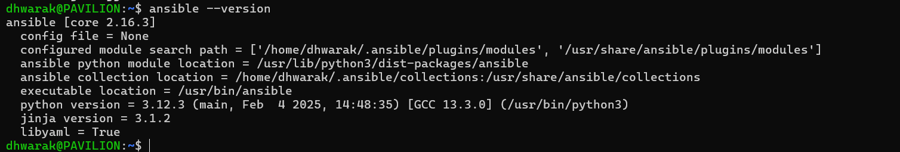
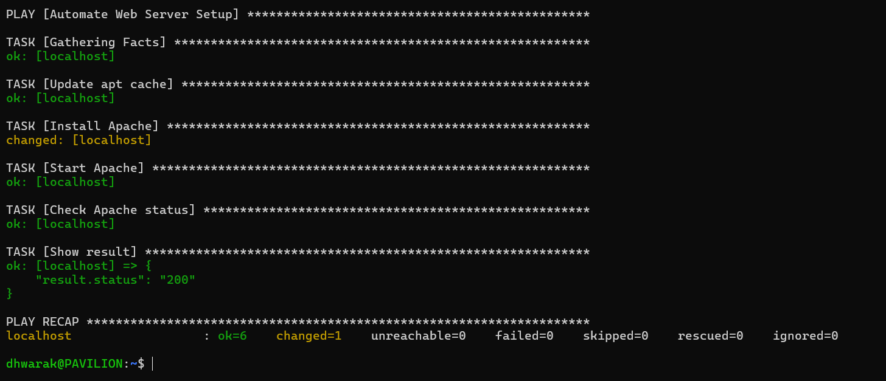
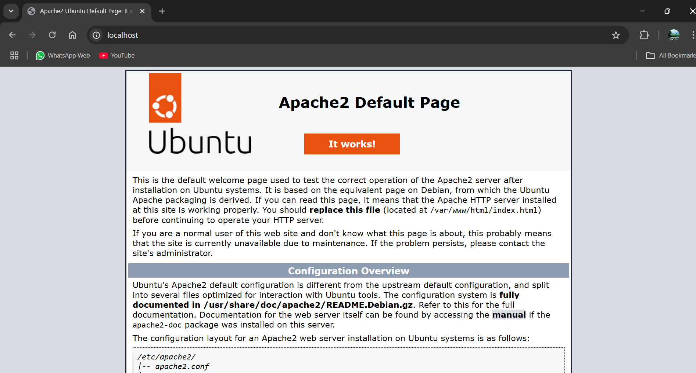

# 🚀 Infrastructure Automation with Ansible  
*Automated Apache Web Server Deployment*  


## 📌 Project Overview
This project demonstrates **infrastructure automation** using Ansible to deploy an Apache web server on a Windows machine via WSL (Windows Subsystem for Linux). It highlights key DevOps practices like configuration management, IaC (Infrastructure as Code), and CI/CD principles.
---

## 📂 Repository Structure
```bash
.
├── inventory              # Target server list
├── webserver_setup.yml    # Ansible playbook
├── screenshots/           # Project visuals
└── README.md              # This documentation


```

---

## 🛠️ Skills Demonstrated
| **Category**       | **Tools/Technologies**                     |
|---------------------|--------------------------------------------|
| **Automation**      | Ansible, YAML Playbooks                    |
| **OS/Environment**  | WSL, Ubuntu, Windows                       |
| **Web Server**      | Apache                                     |
| **Version Control** | Git, GitHub                                |

---

## 📋 Prerequisites
1. **Windows 11/10** with WSL enabled.
2. **Ubuntu 22.04 LTS** (installed via WSL).
3. Basic familiarity with terminal commands.

---

## 📸 Key Screenshots

| **Step**                     | **Screenshot**                              |
|------------------------------|---------------------------------------------|
| 1. Ansible Installation      |  |
| 2. Playbook Execution        |    |
| 3. Apache Welcome Page       |            |

---

## 🚦 Step-by-Step Guide

### 1. Set Up WSL & Ubuntu
```bash
# Install WSL on Windows (PowerShell as Admin)
wsl --install
```
### 2. Install Ansible
```bash
# Update packages and install Ansible
sudo apt update && sudo apt upgrade -y
sudo apt install ansible -y
```
### Verify:
```bash
ansible --version
```
### 3. Configure SSH for Ansible
```bash
# Generate SSH keys (press Enter 3 times)
ssh-keygen
ssh-copy-id localhost
```
### 4. Create Inventory & Playbook
Inventory File (`inventory`):
```ini
[webservers]
localhost
```
### Playbook (webserver_setup.yml)
```yaml
---
- name: Deploy Apache
  hosts: webservers
  become: yes
  tasks:
    - name: Update apt cache
      apt: update_cache=yes
    
    - name: Install Apache
      apt: name=apache2 state=present
    
    - name: Start Apache service
      service: name=apache2 state=started enabled=yes
```

### 5. Run the Playbook
```bash
ansible-playbook -i inventory webserver_setup.yml
```
### 6. Verify Deployment
```bash
curl http://localhost
```
### OR
Open `http://localhost` in your browser.

## 📜 Conclusion

This project showcases my ability to:
-🔹 Automate infrastructure using Ansible.
-🔹 Work in hybrid Windows-Linux environments.
-🔹 Document technical processes clearly.

## Future Enhancements:

-Extend to cloud platforms (AWS/Azure).

-Integrate with CI/CD pipelines (Jenkins/GitHub Actions).

## 👨💻 Author  
[DHWARAKESH SRINIVASAN]  

[](https://www.linkedin.com/in/dhwarakesh-srinivasan-361719292))  
[](https://github.com/git-hub-user7)

